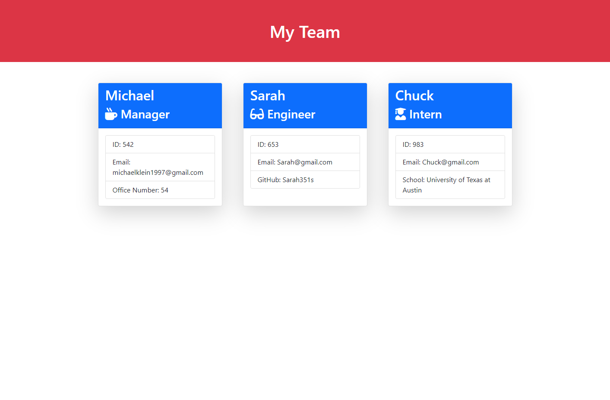

# Team Profile Generator
[](https://opensource.org/licenses/MIT)
[](code_of_conduct.md)

## Table of Contents
- [Description](#Description)
- [Links](#Links)
- [Technologies Used](#Technologies-Used)
- [Screenshot of Application](#Screenshot-of-Application)
- [Installation Instructions](#Installation-Instructions)
- [User Instructions](#User-Instructions)
- [License](#License)
- [Tests](#Tests)
- [Contribution](#Contribution)
- [Acknowledgements](#Acknowledgements)
- [Questions](#Questions)

## Description
**Team Profile Generator** is a Node.js command-line application generates a webpage that displays a develop team and details of its members.  Using the [Inquirer](https://www.npmjs.com/package/inquirer) and [FS](https://nodejs.org/api/fs.html) packages, the user answers several questions that will end up with a dynamically rendered HTML webpage.  **Team Profile Generator** was created so that teams may create their own unique webpage that display that teams info so that they can have quick access to details such as gitHub profiles and emails.

## Technologies Used


## Links
- ### [URL to Video of Application Walkthrough](https://drive.google.com/file/d/1rbL7aWemy4xJLYhPPqqt-8OZLB_SpmD9/view)
- ### [URL to Github Repository](https://github.com/inklein1997/README-Generator)

## Screenshot of Webpage


## Installation Instructions
Since **Team Profile Generator** is a NodeJS application, you must have NodeJS downloaded. Please download [here](https://nodejs.org/en/download/) if you have not done so.
<br><br>
The [Inquirer Package](https://www.npmjs.com/package/inquirer) is reuiqrd for this application.  Prior to running this application, please ensure that the Inquirer package is installed by running the following command in your command-line...
```
npm i inquirer
```

## User Instructions
1. To invoke this application, please enter the following command into the command-line:
```
node index.js
```
2. Answer the prompts in the command-line
3. Once complete, you can open the generated HTML by navigating to **./dist/index.html/**

If you would like to watch a video runthrough of the application, click [Here](https://drive.google.com/file/d/1rbL7aWemy4xJLYhPPqqt-8OZLB_SpmD9/view).

## Tests
**Team Profile Generator** was created utilizing _Test Driven Development_ powered by [Jest](https://jestjs.io/).<br>
If you would like to perform any tests, please invoke the following commands into the command line...
```
npm i jest
```
```
npm test
```
If you would like to watch a video of tests being performed, click [here](https://drive.google.com/file/d/1KCg_cioI9dD5VI7rIxhYE492gfnUCNZl/view)

## License
This project is licensed under the terms of [MIT](https://opensource.org/licenses/MIT).
  
## Contribution
Before contributing to **Team Profile Generator**, please read this [code of conduct](code_of_conduct.md)[^1].<br>
Here's how you can contribute...
1. Add issue or recommendation for improvement to Issues tab on Github.
2. Submit pull request for review.

## Acknowledgements
User Story and original design of the html was provided by the University of Texas at Austin Coding Bootcamp Curriculum.

## Questions
If you have any questions, please contact me via:
1. GitHub -- [@inklein1997](https://github.com/inklein1997)
2. Email -- michaelklein1997@gmail.com

[^1]: Code of Conduct provided by [Contributor Covenant](https://www.contributor-covenant.org/)